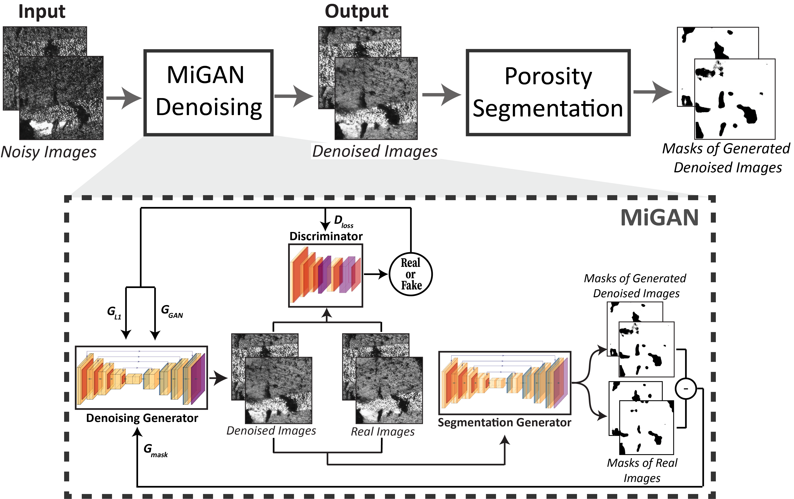

# MiGAN: Generative Adversarial Framework for Microscopy Image Denoising and Accurate Porosity Analysis in Composite Materials
[](https://docs.python.org/3/whatsnew/3.10.html)
[](https://docs.google.com/forms/d/e/1FAIpQLSf3Y4luJThtKg9nrqwB6-Y6HkDNFbBSVRGZYij5MmZtWu8tsg/viewform)
[]()
[]()
[](https://opensource.org/license/mit)

---
## Graphical Abstract


## Overview
**Mi-GAN** is a GAN-based framework designed to perform denoising on microscopy images for pore segmentation. This repository implements a custom version of the Pix2Pix model, tailored to handle microscopy datasets and includes preprocessing, training, testing, and inference pipelines. 

---

## Authors
- **[Lara Fadel](https://composites.usc.edu/lara-fadel/), [Paulo Branicio](https://viterbi.usc.edu/directory/faculty/Branicio/Paulo), [Steven Nutt](https://viterbi.usc.edu/directory/faculty/Nutt/Steven)**
 
  M.C. Gill Composite Center  
  Department of Chemical Engineering and Material Science, University of Southern California  
  Email: [larafade@usc.edu](mailto:larafade@usc.edu)

---

## Installation

First, clone the repo and cd into it:
```bash
git clone https://github.com/larafade/Mi-GAN.git && cd Mi-GAN
```

Install all dependencies:
```bash
pip install -r requirements.txt
```
This repository uses `pyproject.toml` for dependency management. To install the project and its dependencies, run the following command:

```bash
pip install -e .
```

---

## Usage

### Dataset Preparation
After requesting and gaining access to the dataset, please place the raw images under `mi_gan/data/raw/`. Then, run the preprocessing script as follows:

```bash
python scripts/preprocess.py
```
Then, run the dataset creation script:
```bash
python scripts/create_dataset.py
```
Depending on the `config/preprocess_config.yaml`, you will find the datset structure as such:
```
dataset/
├── train/
│   ├── {image_nbr}_{input_polishing_nbr}_1.png
│   ├── {image_nbr}_{input_polishing_nbr}_2.png
├── val/
│   ├── {image_nbr}_{input_polishing_nbr}_3.png
│   ├── {image_nbr}_{input_polishing_nbr}_4.png
├── test/
│   ├── {image_nbr}_{input_polishing_nbr}_5.png
│   ├── {image_nbr}_{input_polishing_nbr}_6.png
```

### Training
Train the model using the provided configuration file:
```bash
python scripts/train.py 
```

### Testing
Evaluate the model on a test dataset:
```bash
python scripts/test.py 
```

### Inference
Perform inference on full images:
```bash
python scripts/inference.py
```
### Results


*Denoising of 1200-grit polished sample. (a) Original image of a 1200-grit polished sample showing surface imperfections and noise. (b) Denoised image generated after inference, illustrating reduced noise and enhanced visibility of surface features. The magnified insets provide a detailed comparison of the same region, emphasizing the improvements achieved through the denoising process.*

---
## Citation
If you find this work useful, please cite MiGAN in your work as follows:

```bibtex
@article{fadel2024migan,
  title={MiGAN: Generative Adversarial Framework for Microscopy Image Denoising 
         and Accurate Porosity Analysis in Composite Materials},
  author={Fadel, Lara and S. Branicio, Paulo and Nutt, Steven},
  journal={McGill Composite Center Research Publications},
  year={2024}
}

